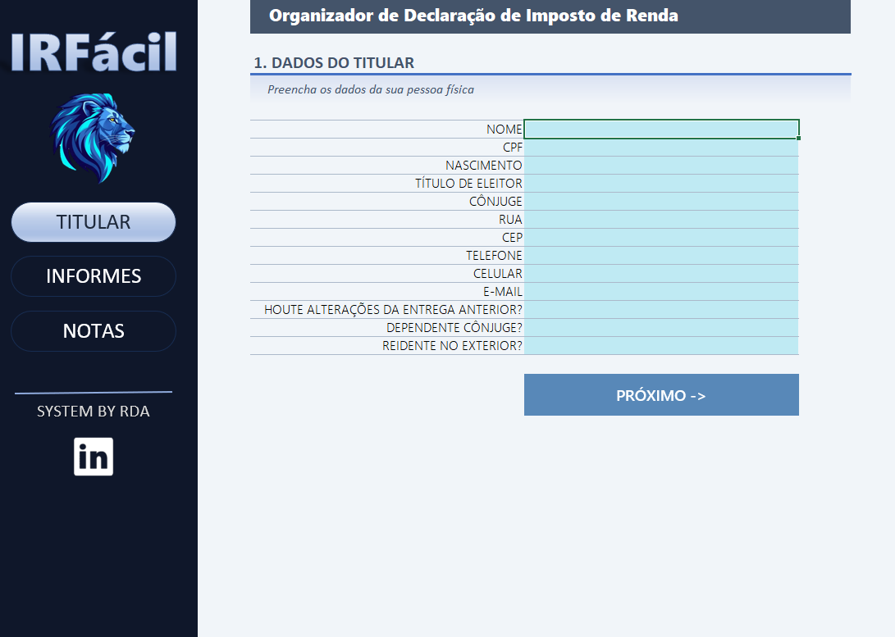
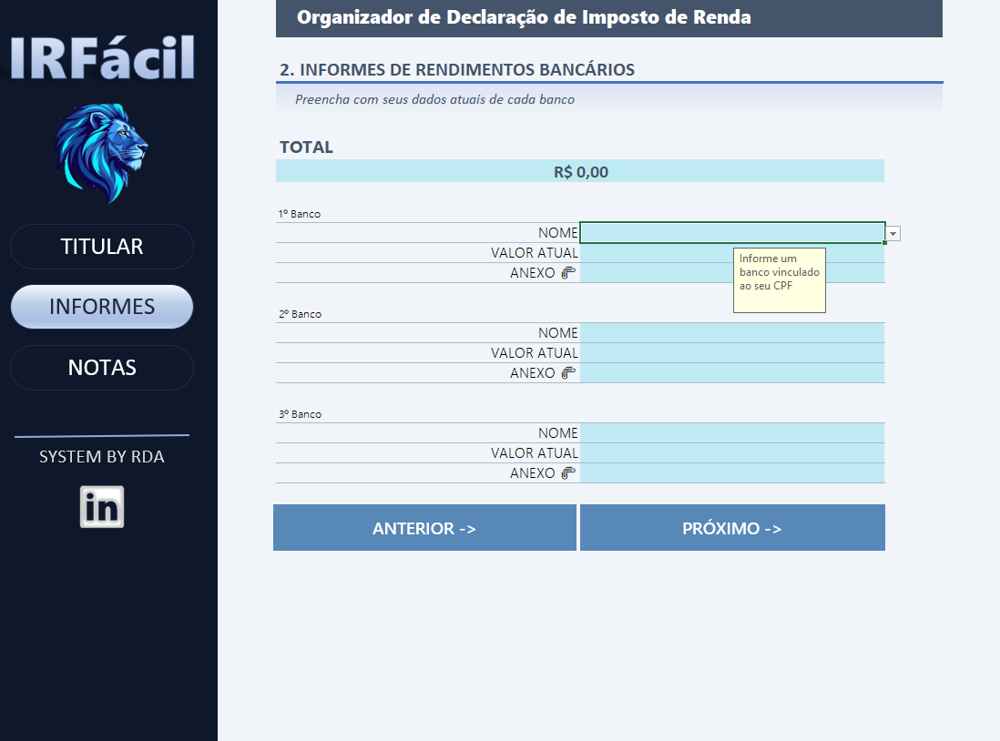
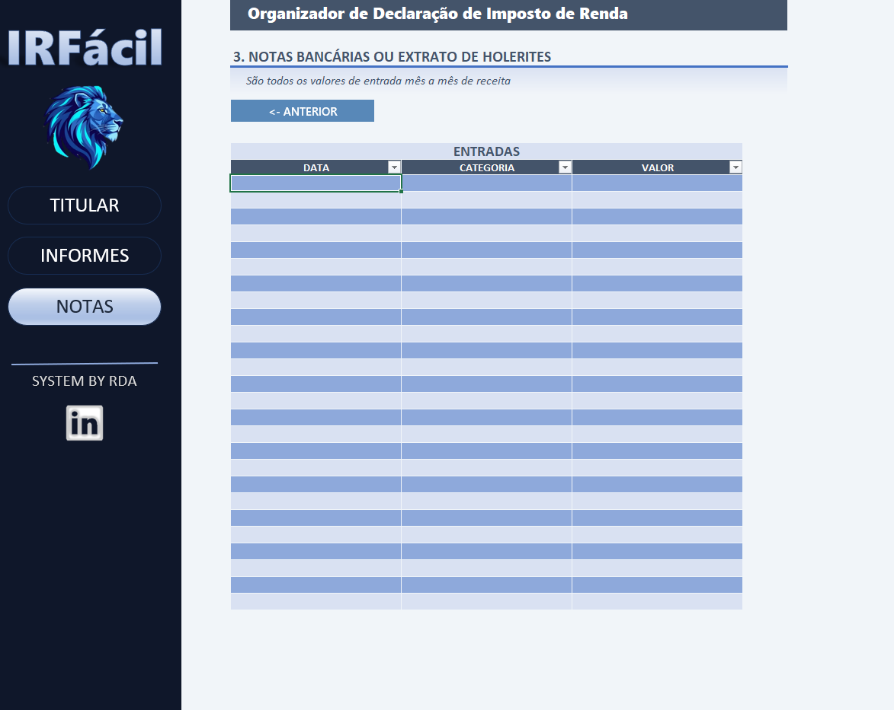

# 🦁 IRFácil — Organizador de Declaração de Imposto de Renda

## 📊 Agregador e Gerenciador de Dados para Imposto de Renda no Excel

Ferramenta interativa desenvolvida em Microsoft Excel como projeto prático do curso da **DIO**, com foco na centralização, organização e validação de informações essenciais para a declaração anual do Imposto de Renda de Pessoa Física (IRPF).

---

## 📑 Sobre o projeto

O **IRFácil** transforma a coleta descentralizada de dados fiscais em uma interface amigável, intuitiva e estruturada no formato *Dashboard/App*. A solução permite controlar cadastros do titular, consolidação de saldos bancários e registro de entradas mensais de forma prática e segura.

A planilha foi construída para evitar erros de preenchimento e acelerar a rotina de prestação de contas com o Fisco por meio de **menus interativos, validações de dados automáticas, indicadores de totais e atalhos de navegação**.

---

## 🎯 Objetivo

Criar uma solução visual e funcional capaz de organizar dados cadastrais, financeiros e comprovantes anexos em um único ambiente, garantindo integridade e agilidade antes do envio da declaração oficial.

---

## 🚀 Principais funcionalidades

* **Navegação por Sidebar Lateral:** Alternância rápida entre os módulos (*Titular*, *Informes* e *Notas*);
* **Formulário Cadastral do Titular:** Coleta padronizada de dados pessoais, contatos e perguntas declaratórias com validação automática (`SIM/NÃO`);
* **Consolidação de Informes Bancários:** Módulo para registro de saldos por instituição financeira e cálculo automático do **Total Acumulado** via fórmula `=SOMA()`;
* **Base Auxiliar de Bancos:** Lista integrada contando com mais de 50 instituições financeiras e fintechs para seleção padronizada;
* **Anexo de Comprovantes:** Mapeamento visual para inserção de arquivos e informes em formato digital (`📎`);
* **Tabela de Entradas e Receitas:** Registro sequencial mês a mês de notas bancárias e extratos de holerites com validação por categoria (`HOLERITE`, `FREELANCE`, `CNPJ`);
* **Botões de Navegação Dinâmica:** Botões operacionais (*Próximo*, *Anterior*) facilitando o fluxo entre etapas;
* **Tabelas Zebradas (*Zebra Striping*):** Formatação visual alternada para facilitar a leitura das entradas de receita.

---

## 📈 Módulos e Indicadores

O organizador está dividido em três pilares principais:

1. **Dados do Titular:**
   * Informações pessoais (CPF, Título de Eleitor, Cônjuge);
   * Endereço e contatos (Rua, CEP, Telefone, Celular, E-mail);
   * Flags de controle (*Houve alterações da entrega anterior?*, *Dependente Cônjuge?*, *Residente no exterior?*).
2. **Informes de Rendimentos Bancários:**
   * Mapeamento individual por instituição (1º Banco, 2º Banco, 3º Banco);
   * Valor atual disponível por conta;
   * Indicador consolidado do **Total Geral em Contas**;
   * Campo direto para vínculo de anexos por banco (`📎`).
3. **Notas Bancárias ou Extrato de Holerites:**
   * Lançamento de receita com campos para **Data**, **Categoria** e **Valor**;
   * Suporte a filtros interativos por coluna.

---

## 🖼️ Demonstração da Interface

### 1. Dados do Titular
Módulo de cadastro do titular com formulário claro e botões de avanço.



---

### 2. Informes de Rendimentos Bancários
Tela de consolidação de saldos bancários com cálculo automático do total acumulado e campo de anexos.



---

### 3. Registro de Entradas e Holerites
Tabela zebrada para controle de receita mês a mês com filtros operacionais.



---

## 🗂️ Estrutura do repositório

```text
irfacil_organizador/
│
├── images/
│   ├── dados_titular.png
│   ├── informe_bancario.png
│   └── notas_entrada.png
│
├── IRFacil.xlsx
└── README.md
